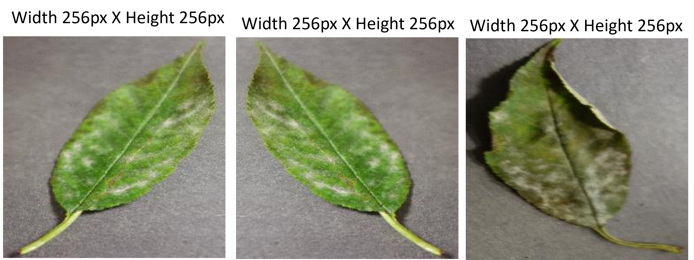
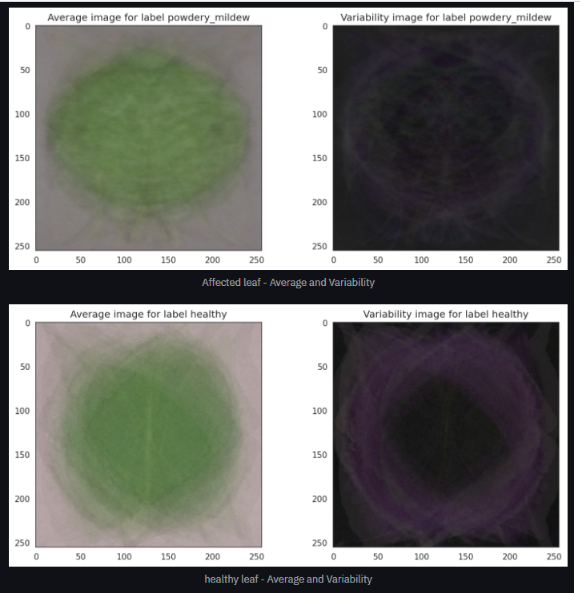
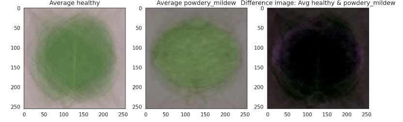

## Table of Contents
1. [Dataset Content](#dataset-content)
2. [Business Requirements](#business-requirements)
3. [Hypothesis and validation](#hypothesis-and-validation)
4. [Rationale for the model](#the-rationale-for-the-model)
5. [Trial and error](#trial-and-error)
6. [Implementation of the Business Requirements](#the-rationale-to-map-the-business-requirements-to-the-data-visualizations-and-ml-tasks)
7. [ML Business case](#ml-business-case)
8. [Dashboard design](#dashboard-design-streamlit-app-user-interface)
9. [CRISP DM Process](#the-process-of-cross-industry-standard-process-for-data-mining)
10. [Bugs](#bugs)
11. [Deployment](#deployment)
12. [Technologies used](#technologies-used)
13. [Credits](#credits)

### Deployed version at [cherry-leaves-powdery-mildew-detector-app.herokuapp.com](https://mildew-leaves-detector-1a60bad7c5a0.herokuapp.com)

## Dataset Content

The dataset contains +4000 featured photos of single cherry leaves against a neutral background. The images are taken from the client's crop fields and show leaves that are either healthy or infected by [powdery mildew](https://ca.decisionaid.systems/articles/cherry_powdery_mildew) a biotrophic fungus. This disease affects many plant species but the client is particularly concerned about their cherry plantation crop since there are worries about their customers. The dataset is sourced from [Kaggle](https://www.kaggle.com/datasets/codeinstitute/cherry-leaves).

## Business Requirements

We were requested by our client Farmy & Foods a company in the agricultural sector to develop a Machine Learning based system to detect instantly whether a certain cherry tree presents powdery mildew thus needs to be treated with a fungicide. 
The requested system should be capable of detecting instantly, using a tree leaf image, whether it is healthy or infected. 
The system was requested by the Farmy & Food company to automate the detection process conducted manually thus far. The company has thousands of cherry trees, located on multiple farms across the country. As a result, this manual process is not scalable due to the time spent in the manual process inspection.
Link to the wiki section of this repo for the full [business interview](https://github.com/ujuadimora-dev/mildew-detection-in-cherry-leaves/wiki/Business-Review-of-Farmy-&-Foods-Company). 

Summarizing:

1. The client is interested in conducting a study to visually differentiate a healthy cherry leaf from one infected by powdery mildew.
2. The client is interested in predicting if a cherry tree is healthy or contains powdery mildew.
3. The client is interested in obtaining a prediction report of the examined leaves. 

## Hypothesis and validation

1. **Hypothesis**: Infected leaves have clear marks differentiating them from the healthy leaves.
   - __How to validate__: Research about the disease and build an average image study can help to investigate it.<br/>

2. **Hypothesis**: The EarlyStopping callback is used to monitor the validation loss during training. 
   - __How to validate__: If the validation loss does not improve for three consecutive epochs the trainin will stopped early to prevent overfitting and save time"<br/>


### Hypothesis 1
* Infected leaves have clear marks differentiating them from the healthy leaves.

**1. Introduction**

We suspect cherry leaves affected by powdery mildew have clear marks, typically the first symptom is a light-green, circular lesion on either leaf surface, then a subtle white cotton-like growth develops in the infected area. This property has to be translated in machine learning terms, images have to be 'prepared' before being fed to the model for an optimal feature extraction and training. 

   1. Understand problem and mathematical functions

When we are dealing with an Image dataset, it's important to normalize the images in the dataset before training a Neural Network on it. This is required because of the following two core reasons:
- It helps the trained Neural Network give consistent results for new test images.
- Helps in Transfer Learning
To normalize an image, one will need the mean and standard deviation of the entire dataset.

To calculate the **mean** and **standard deviation**, the mathematical formula takes into consideration four dimensions of an image (B, C, H, W) where:
- B is batch size that is number of images
- C is the number of channels in the image which will be 3 for RGB images.
- H is the height of each image
- W is the width of each image
Mean and std is calculated

**2. Observation**

An Image Montage shows the evident difference between a healthy leaf and an infected one. 




Difference between average and variability images shows that affected leaves present more white stipes on the center.



While image difference between average infected and average infected leaves shows no intuitive difference. 



**3. Conclusion**

The model was able to detect such differences and learn how to differentiate and generalize in order to make accurate predictions.
A good model trains its ability to predict classes on a batch of data without adhering too closely to that set of data.
In this way the model is able to generalize and predict future observation reliably because it didn't 'memorize' the relationships between features and labels as seen in the training dataset but the general pattern from feature to labels.


### Hypothesis 2
For further details the results mentioned in this section can be downloaded here [ hypothesis](attechment/Modeling&Evalaution.ipynb) 

**1. Introduction**

   1. Understand problem 

Classification is a type of supervised machine learning problem where the goal is to categorize or assign input data points to one or more predefined categories or classes. In the context of this project, am dealing with a classification problem related to cherry leaves, specifically distinguishing between healthy and infected leaves

Classification is a supervised learning task, meaning that it requires a labeled dataset for training. In this case , dataset of cherry leaf images, and each image is associated with a label indicating whether it's "healthy" or "powdery_mildew."
 <br/> 

 Binary Classification: Binary classification is a specific type of classification where the model's goal is to categorize data points into one of two classes. In this  project, the two classes are "healthy"(0) and "powdery_mildew.(1)" The model's output for each leaf image will be one of these two categories.

Backpropagation is where the “learning” or “adjustment” takes place in the neural network in order to adjust the weights of all the nodes throughout the layers of the network. The error value (distance between actual and predicted label) flows back through the network in the opposite direction as before <br/>

 So, the goal is to build a model that can analyze images of cherry leaves and correctly classify them as "healthy" or "infected."

   2. Understand how to evaluate the performance
   
A learning curve is a plot of model learning performance over experience or time.
Learning curves are a widely used diagnostic tool in machine learning for algorithms that learn from a training dataset incrementally. The model can be evaluated on the training dataset and on a hold out validation dataset after each update during training and plots of the measured performance can created to show learning curves.
Reviewing learning curves of models during training can be used to diagnose problems with learning, such as an underfit or overfit model, as well as whether the training and validation datasets are suitably representative. <br/>
Generally, a learning curve is a plot that shows time or experience on the x-axis (Epoch) and learning or improvement on the y-axis (Loss/Accuracy).
   -  **Epoch**: refers to the one entire passing of training data through the algorithm. 
   -  **Loss**: Loss is the penalty for a bad prediction. That is, loss is a number indicating how bad the model's prediction was on a single example. If the model's prediction is perfect, the loss is zero; otherwise, the loss is greater. In our case loss on training set was evaluated against loss on validation set.
   -  **Accuracy**: Accuracy is the fraction of predictions our model got right. Again accuracy on the training set was measured against accuracy on the validation set. 

In our plot we will be looking for a *good fit* of the learning algorithm which exists between an overfit and underfit model
A good fit is identified by a training and validation loss that decreases to a point of stability with a minimal gap between the two final loss/accuracy values.
We should expect some gap between the train and validation loss/accuracy learning curves. This gap is referred to as the “generalization gap.”
A plot of learning curves shows a good fit if:
   -  The plot of training loss decreases (or increases if it's an accuracy plot) to a point of stability.
   -  The plot of validation loss decreases/increases to a point of stability and has a small gap with the training loss.
   -  Continued training of a good fit will likely lead to an overfit (That's why ML models usually have a [early stopping](https://en.wikipedia.org/wiki/Early_stopping) which interrupts the model's learning phase when it stops to improve).
  
**2. Observation**

The model was set to train only on 25 Epoch with early stoppings, So as to avoid over heating.
The same hyperparameters were set for both examples. 
 
 - Loss/Accuracy of LSTM model train
 
   [check the site and click on the ML performance Metric](https://mildew-leaves-detector-1a60bad7c5a0.herokuapp.com/) 
 - Loss/Accuracy of LSTM model trained


### Choosing the hyperparameters

- **Sequential Model**: This to  stack layers on top of each other sequentially.
Convolutional Neural Network (CNN) Layers:

**"2D convolutional layer"**:  Add 2D convolutional layer to the model with 32 filters, a kernel size of (3, 3), ReLU activation function, and an input shape defined as image_shape. Convolutional layers are used for feature extraction from images.

**Max-pooling**: Adds a max-pooling layer after the convolutional layer. Max-pooling is used to downsample the spatial dimensions of the feature maps.

**Additional Convolutional Layers**:Two more sets of convolutional and max-pooling layers with different filter sizes (64 filters) and kernel sizes are added to capture more complex features from the input image.

**Flattening Layer**: Additional flattening layer that converts the output of the convolutional layers into a 1D vector. This is necessary before passing the data to fully connected (dense) layers.

**Fully Connected Layers**: This  add dense (fully connected) layer with 128 neurons and ReLU activation. These layers are used for learning complex relationships in the data.
**Dropout** : This adds a dropout layer with a dropout rate of 0.5. Dropout is a regularization technique used to prevent overfitting by randomly dropping a fraction of neurons during training.
**Dense(1, activation='sigmoid')**: This adds the output layer with a single neuron and sigmoid activation function. This is common for binary classification tasks, where the model outputs a probability that the input belongs to the positive class (e.g., "infected").

Overall, This is convolutional neural network (CNN) model for binary image classification. It consists of multiple convolutional layers for feature extraction, followed by fully connected layers for classification. Dropout is applied to prevent overfitting, and the output layer uses sigmoid activation to produce binary classification results.

**Source**: 
- [convolution2dLayer](https://www.mathworks.com/help/deeplearning/ref/nnet.cnn.layer.convolution2dlayer.html) 
- [The advantages of ReLu](https://www.datasciencecentral.com/deep-learning-advantages-of-relu-over-sigmoid-function-in-deep/#:~:text=Relu%20%3A%20More%20computationally%20efficient%20to,(Krizhevsky%20et%20al.)
- [Maxpooling](https://www.quora.com/What-is-Max-Pooling-2D#:~:text=Max%20pooling%202D%20is%20a,a%20sample%2Dbased%20discretization%20process.)
- [How ReLU and Dropout Layers Work in CNNs](https://www.baeldung.com/cs/ml-relu-dropout-layers)

### Hidden Layers

They are “hidden” because the true values of their nodes are unknown in the training dataset as we only know the input and output.</br> 
These layers perform feature extraction and classification based on those features. 

>There are really two decisions that must be made regarding the hidden layers: how many hidden layers to actually have in the neural network and how many neurons will be in each of these layers. 
Using too few neurons in the hidden layers will result in something called underfitting. Underfitting occurs when there are too few neurons in the hidden layers to adequately detect the signals in a complicated data set.
Using too many neurons in the hidden layers can result in several problems. First, too many neurons in the hidden layers may result in overfitting. 

*
>In order to secure the ability of the network to generalize the number of nodes has to be kept as low as possible. If you have a large excess of nodes, you network becomes a memory bank that can recall the training set to perfection, but does not perform well on samples that was not part of the training set. 


### Model Compilation

- **Loss**: A loss function is a function that compares the target and predicted output values; measures how well the neural network models the training data. When training, we aim to minimize this loss between the predicted and target outputs. `categorical_crossentropy` (also called Softmax Loss. It is a Softmax activation plus a Cross-Entropy loss) was used since the problem has been treated as multiclass classification. See [Hypothesis 2](#Hypothesis-2) for more details.

- **Optimizer**: An optimizer is a function or algorithm that is created and used for neural network attribute modification (i.e., weights, learning rates) for the purpose of speeding up convergence while minimizing loss and maximizing accuracy. `adam` was chosen going through the trial and error phase.

- **Metrics**: `accuracy` Calculates how often predictions equal labels. This metric creates two local variables, total and count that are used to compute the frequency with which `y_pred` matches `y_true`.  

**Source**: 
- [7 tips to choose the best optimizer](https://towardsdatascience.com/7-tips-to-choose-the-best-optimizer-47bb9c1219e) by [Davide Giordano](https://medium.com/@davidegiordano)
- [Impact of Optimizers in Image Classifiers](https://towardsai.net/p/l/impact-of-optimizers-in-image-classifiers)
- [Keras Accuracy Metrics](https://keras.io/api/metrics/accuracy_metrics/#:~:text=metrics.,with%20which%20y_pred%20matches%20y_true%20.)


## The rationale to map the business requirements to the Data Visualizations and ML tasks

The three main business requirements were split in several user stories which were translated in Machine Learning Tasks. 
**All the tasks were manually tested and function as expected.**

### Business Requirement 1: Data Visualization 
>The client is interested in having a study that visually differentiates a cherry leaf affected by powdery mildew from a healthy one.

In terms of **User Story**:
- As a client I want to navigate easily around an interactive dashboard so that I can view and understand the data presented.
- As a client I want to display the "mean" and "standard deviation" images for cherry leaves that are healthy and cherry leaves that contain powery mildew so that I can visully differentiate cherry leaves. 
- As a client I want to display the difference between an average cherry leaf that is healthy and cherry leaf that contains powdery mildew, so that I can visually differentiate cherry leaves. 
- As a client I wan to display an image montage for cherry leaves that are Healthy and cherry leaves that contain powdery mildew so that I can visually differentiate cherry leaves. 

**To understand why this is important and how it works, see [Hypotesis 1](#hypothesis-1)**

The User Story were addressed implementing the following tasks which are presented in the streamlit dashboard and calculated in the Data Visualization notebook:

-  A Streamlit-based dashboard with an easy navigation side bar (see [Dashboard design](https://mildew-leaves-detector-1a60bad7c5a0.herokuapp.com/) for a detailed presentation)
-  The difference between an average infected leaf and an average healthy leaf.
-  The "mean" and "standard deviation" images for healthy and powdery mildew infected leaves 
-  Image montage for either infected or healthy leaves.

### Business Requirement 2: Classification
>The client is interested in telling whether a given cherry leaf is affected by powdery mildew or not.

In terms of **User Story**:
- As a client I want a ML model to predict with an accuracy of at least 86% whether a given cherry leaf is healthy or contains powdery mildew. 

The User Story were addressed implementing the following tasks which are presented in the streamlit dashboard and calculated in the Data Visualization notebook:

- The rationale for the ML model deployed to answer the request is presented [here](https://mildew-leaves-detector-1a60bad7c5a0.herokuapp.com/)
- The client can upload cherry leaves images to the dashboard through an *uploader widget* to get an instant evaluation. Here are the key features of this functionality:
  - Images have to be uploaded in `.png` format. 
  - It's possible to upload multiple images at once up to 200MB. 
  - The dashboard will display the uploaded image and its relative prediction statement, indicating whether the leaf is infected or not with powdery mildew and the probability associated with this statement.

### Business Requirement 3: Report
>The client is interested in obtaining a prediction report of the examined leaves. 

In terms of **User Story**:
- As a client I want to obtain a report from the ML predictions on new leaves.  

The User Story were addressed implementing the following tasks which are presented in the streamlit dashboard:
- Following each batch of uploaded images a downloadable `.csv` report is available with the predicted status. 

## ML Business Case

**Visit the Project Handbook on [Wiki](https://github.com/ujuadimora-dev/mildew-detection-in-cherry-leaves/wiki/Handbook-for-Cherry_leaf-Mildew-detector)**

### Powdery Mildew classificator
- We want an ML model to predict if a leaf is infected with powdery mildew or not, based on the image database provided by the Farmy & Foods company. The problem can be understood as supervised learning, a two/multi-class, single-label, classification model.
- Our ideal outcome is to provide the farmers a faster and more reliable detector for powdery mildew detection.
- The model success metrics are
    - Accuracy of 87% or above on the test set.
- The model output is defined as a flag, indicating if the leaf has powdery mildew or not and the associated probability of being infected or not. The farmers will take a picture of a leaf and upload it to the App. The prediction is made on the fly (not in batches).
- Heuristics: The current detection method is based on a manual inspection. A farmer spends around 30 minutes in each tree, taking a few samples of tree leaves and verifying visually if the leaf tree is healthy or has powdery mildew. Visual criteria is slow and it leaves room to produce inaccurate diagnostics due to human error. 
- The training data to fit the model come from the leaves database provided by Farmy & Foody company and uploaded on Kaggle. This dataset contains +4000 images of cherry leaves. 

 click on the leave dectector Tab and upload the leave you to detect

## Dashboard Design (Streamlit App User Interface)

### Page 1: Quick Project Summary
- Quick project summary
    - General Information:
        - Powdery mildew is a parasitic fungal disease caused by Podosphaera clandestina in cherry trees. When the fungus begins to take over the plants, a layer of mildew made up of many spores forms across the top of the leaves. The disease is particularly severe on new growth, can slow down the growth of the plant and can infect fruit as well, causing direct crop loss.
        - Visual criteria used to detect infected leaves are light-green, circular lesion on either leaf surface and later on a subtle white cotton-like growth develops in the infected area on either leaf surface and on the fruits thus reducing yield and quality."
- Project Dataset
The available dataset provided by Farmy & Foody contains 4208 featured photos of single cherry leaves against a neutral background. The leaves are either healthy or infested by cherry powdery mildew.
- Business requirements:
    1. The client is interested to have a study to visually differentiate between a parasite-contained and uninfected leaf.
    2. The client is interested in telling whether a given leaf contains a powdery mildew parasite or not.
    3. The client is interested in obtaining a prediction report of the examined leaves. 
- Link to this Readme.md file for additional information about the project. 

### Page 2: leaves Visualizer
It will answer business requirement #1
- Checkbox 1 - Difference between average and variability image
- Checkbox 2 - Differences between average parasitised and average uninfected leaves
- Checkbox 3 - Image Montage
- Link to this Readme.md file for additional information about the project. 

### Page 3: Powdery mildew Detector
- Business requirement #2 and #3 information - "The client is interested in telling whether a given leaf is infected with powdery mildew or not and obtaining a   downloadable report of the examined leaves."
- Link to download a set of parasite-contained and uninfected leaf images for live prediction on [Kaggle](https://www.kaggle.com/datasets/codeinstitute/cherry-leaves)
- User Interface with a file uploader widget. The user can upload multiple cherry leaves images. It will display the image, a barplot of the visual representation of the prediction and the prediction statement, indicating if the leaf is infected or not with powdery mildew and the probability associated with this statement.
- Table with the image name and prediction results.
- Download button to download the report in a ```.csv``` format. 
- Link to this Readme.md file for additional information about the project. 
  
### Page 4: Project Hypothesis and Validation
- Block for each project hypothesis including statement, explanation, validation and conclusion. See [Hypothesis and validation](#Hypothesis-and-validation)
- Link to this Readme.md file for additional information about the project. 

### Page 5: ML Performance Metrics
- Label Frequencies for Train, Validation and Test Sets
- Dataset percentage distribution among the three sets
- Model performance - ROC curve
- Model accuracy - Confusion matrix
- Model History - Accuracy and Losses of LSTM Model
- Model evaluation result on Test set

## The process of Cross-industry standard process for data mining
CRISP-DM, which stands for Cross-Industry Standard Process for Data Mining, is an industry-proven way to guide your data mining efforts.

- As a methodology, it includes descriptions of the typical phases of a project, the tasks involved with each phase, and an explanation of the relationships between these tasks.
- As a process model, CRISP-DM provides an overview of the data mining life cycle.

**Source**: [IBM - crisp overview](https://www.ibm.com/docs/it/spss-modeler/saas?topic=dm-crisp-help-overview)

A kanban board is an agile project management tool designed to help visualize work, limit work-in-progress, and maximize efficiency (or flow). It can help both agile and DevOps teams establish order in their daily work. Kanban boards use cards, columns, and continuous improvement to help technology and service teams commit to the right amount of work, and get it done!

**Source**: [Github - Project boards](https://unito.io/blog/github-projects-agile/#:~:text=Use%20GitHub's%20agile%20projects,-Since%20October%202016&text=GitHub%20Projects%20let%20you%20have,any%20repository%2C%20like%20this%20one.)


The CRISP-DM process is divided in [sprints](hhttps://github.com/users/ujuadimora-dev/projects/7/views/1/). Each sprint has Epics based on each CRISP-DM task which were subsequently split into task. Each task can be either in the *To Do*, *In progress*, *Review* status as the workflow proceeds and contains in-depth details.


## Bugs
In heroku app. This prject was made to run in Stack 22 and with the new version of Python 3.11 . I made the changes accordingly. On delpyment to Heroku, I found that most of the dependences on the requirements.txt are old versions and of course the  the deployment fails,  i was doing trial  and errors, this made to spend some time on this project. Even at time, i removed all the version on the rquirments.txt Then another issues is the at the file is so large and then the deploment fails of course

### Fixed Bug
So this was later fixed by using this command [heroku login -i] (https://stackoverflow.com/questions/63363085/ip-address-mismatch-on-signing-into-heroku-cli)to set the Heroku app to accespt the project on Stack 20


## Deployment
The project is coded and hosted on GitHub and deployed with [Heroku](https://www.heroku.com/). 

### Creating the Heroku app 
The steps needed to deploy this projects are as follows:

1. Create a `requirement.txt` file in GitHub, for Heroku to read, listing the dependencies the program needs in order to run.
2. Set the `runtime.txt` Python version to a Heroku-20 stack currently supported version.
3. `push` the recent changes to GitHub and go to your [Heroku account page](https://id.heroku.com/login) to create and deploy the app running the project. 
3. Chose "CREATE NEW APP", give it a unique name, and select a geographical region. 
4. Add  `heroku/python` buildpack from the _Settings_ tab.
5. From the _Deploy_ tab, chose GitHub as deployment method, connect to GitHub and select the project's repository. 
6. Select the branch you want to deploy, then click Deploy Branch.
7. Click to "Enable Automatic Deploys " or chose to "Deploy Branch" from the _Manual Deploy_ section. 
8. Wait for the logs to run while the dependencies are installed and the app is being built.
9. The mock terminal is then ready and accessible from a link similar to `https://your-projects-name.herokuapp.com/`
10. If the slug size is too large then add large files not required for the app to the `.slugignore` file.
   
### Forking the Repository

- By forking this GitHub Repository you make a copy of the original repository on our GitHub account to view and/or make changes without affecting the original repository. The steps to fork the repository are as follows:
    - Locate the [GitHub Repository](https://github.com/ujuadimora-dev/mildew-detection-in-cherry-leaves) of this project and log into your GitHub account. 
    - Click on the "Fork" button, on the top right of the page, just above the "Settings". 
    - Decide where to fork the repository (your account for instance)
    - You now have a copy of the original repository in your GitHub account.

### Making a local clone

- Cloning a repository pulls down a full copy of all the repository data that GitHub.com has at that point in time, including all versions of every file and folder for the project. The steps to clone a repository are as follows:
    - Locate the [GitHub Repository](https://github.com/ujuadimora-dev/mildew-detection-in-cherry-leaves) of this project and log into your GitHub account. 
    - Click on the "Code" button, on the top right of your page.
    - Chose one of the available options: Clone with HTTPS, Open with Git Hub desktop, Download ZIP. 
    - To clone the repository using HTTPS, under "Clone with HTTPS", copy the link.
    - Open Git Bash. [How to download and install](https://phoenixnap.com/kb/how-to-install-git-windows).
    - Chose the location where you want the repository to be created. 
    - Type:
    ```
    $ git clone https://git.heroku.com/cherry-powdery-mildew-detector.git
    ```
    - Press Enter, and wait for the repository to be created.
    - Click [Here](https://help.github.com/en/github/creating-cloning-and-archiving-repositories/cloning-a-repository#cloning-a-repository-to-github-desktop) for a more detailed explanation. 

__You can find the live link to the site here: [Cherry Powdery Mildew Detector](https://mildew-leaves-detector-1a60bad7c5a0.herokuapp.com/)__

## Technologies used

### Platforms
- [Heroku](https://en.wikipedia.org/wiki/Heroku) To deploy this project
- [Jupiter Notebook](https://jupyter.org/) to edit code for this project
- [Kaggle](https://www.kaggle.com/) to download datasets for this project
- [GitHub](https://github.com/): To store the project code after being pushed from Gitpod.
- [Codeanywhere workspace](https://app.codeanywhere.com/) Gitpod Dashboard was used to write the code and its terminal to 'commit' to GitHub and 'push' to GitHub Pages.

### Languages
- [Python](https://www.python.org/)
- [Markdown](https://en.wikipedia.org/wiki/Markdown)
  
### Main Data Analysis and Machine Learning Libraries
<pre>
- tensorflow-cpu 2.6.0  used for creating the model
- numpy 1.19.2          used for converting to array 
- scikit-learn 0.24.2   used for evaluating the model
- streamlit 0.85.0      used for creating the dashboard
- pandas 1.1.2          used for creating/saving as dataframe
- matplotlib 3.3.1      used for plotting the sets' distribution
- keras 2.6.0           used for setting model's hyperparamters
- plotly 5.12.0         used for plotting the model's learning curve 
- seaborn 0.11.0        used for plotting the model's confusion matrix
- streamlit             used for creating and sharing this project's interface
</pre>

## Credits

This section lists the sources used to build this project. 

### Content
- The leaves dataset was linked from [Kaggle](https://www.kaggle.com/datasets/codeinstitute/cherry-leaves) and created by [Code Institute](https://www.kaggle.com/codeinstitute)
- The powdery mildew description was taken from [This site](https://www.planetnatural.com/pest-problem-solver/plant-disease/powdery-mildew) 


### Code
-  This project was developed by Adimora Uju Louisa - [ujuadimora-dev](https://github.com/ujuadimora-dev) on GitHub. 
-  The template used for this project belongs to CodeInstitute - [website](https://codeinstitute.net/global/).
- App pages for the Streamlit dashboard, data collection and data visualization jupiter notebooks are from [Code Institute WP01]https://github.com/Code-Institute-Solutions/WalkthroughProject01) and where used as a backbone for this project.


### Acknowledgements

Thanks to [Code Institute](https://codeinstitute.net/global/) 

### Deployed version at [cherry-powdery-mildew-detector.herokuapp.com](https://mildew-leaves-detector-1a60bad7c5a0.herokuapp.com/)